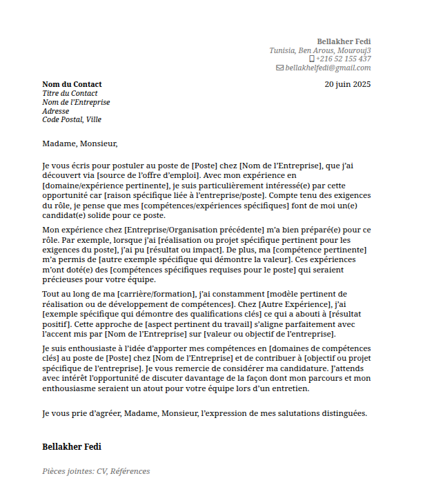
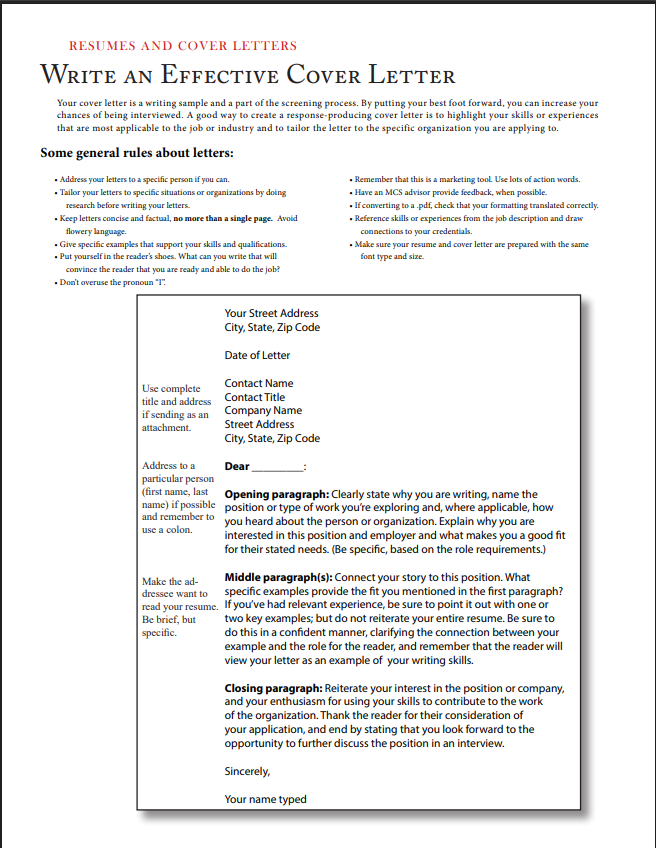

# Cover Letter Template

A professional and fully customizable cover letter template to help you craft compelling, effective cover letters for any job application. This project streamlines the process by providing clear structure, modern formatting, and actionable guidance, making it easy to tailor your letter for any position or industry.

> **Note:** This template draws inspiration from the [Harvard Extension School 2024 Resume and Letter Guide (PDF)](https://cdn-careerservices.fas.harvard.edu/wp-content/uploads/sites/161/2024/10/2024-HES_resume-and-letter.pdf) and incorporates best practices for both content and layout.

[](main.pdf)

## What’s Included

- **Modern, clean design:** Present your qualifications with a polished, recruiter-friendly look.
- **Effortless customization:** Update your information, skills, and experience in minutes.
- **Multi-format support:** Use Markdown natively, or export to LaTeX, Word, or PDF.
- **Comprehensive structure:** All essential elements for a standard, professional cover letter.
- **Best-practice guidance:** Advice and examples based on leading career services recommendations.
- **Multilingual support:** Example templates are included in multiple languages.

## Visual Examples

**Image 1:**  
A French-language cover letter template, demonstrating how to structure your information, personalize the content, and maintain a professional format. The template includes all key elements: contact information, date, recipient details, introduction, experience highlights, and a closing section.  


**Image 2:**  
A best-practices guide from Harvard on writing an effective cover letter. This reference outlines general rules, tips, and a detailed English-language template, emphasizing clarity, specificity, and alignment with the job requirements.  


## Getting Started

### Prerequisites

- Any [Markdown editor](https://typora.io/) or code editor (VS Code, Atom, etc.)
- (Optional) [Pandoc](https://pandoc.org/) for exporting your letter to PDF or Word formats.

### How to Use

1. **Clone this repository:**
   ```bash
   git clone https://github.com/fedei10/cover-letter-template.git
   ```
2. **Open `cover-letter-template.md`** (or your chosen language template) in your preferred editor.
3. **Personalize the template:**
   - Replace placeholder text (name, address, company, etc.) with your details.
   - Adapt the letter body to reflect your experiences and the requirements of the specific job.
4. **Export or print:**
   - Save as PDF or print directly from your editor.
   - Or use Pandoc for advanced exporting:
     ```bash
     pandoc cover-letter-template.md -o cover-letter.pdf
     ```

## Example Structure

```
Your Name
Your Address
City, State ZIP
Email | Phone

Date

Hiring Manager Name
Company Name
Company Address

Dear [Hiring Manager Name],

[Body of your cover letter: Introduction, relevant skills and experience, alignment with the role, closing statement.]

Sincerely,  
Your Name
```

## Contributing

Contributions are welcome! Please open issues or submit pull requests for new features, improvements, or fixes. Suggestions and community feedback are highly appreciated.

## License

This project is licensed under the MIT License. See [LICENSE](LICENSE) for details.

## Contact

For questions, ideas, or support, open an issue or reach out to [@fedei10](https://github.com/fedei10).

---

_Empowering you to make a strong first impression—every time you apply._
